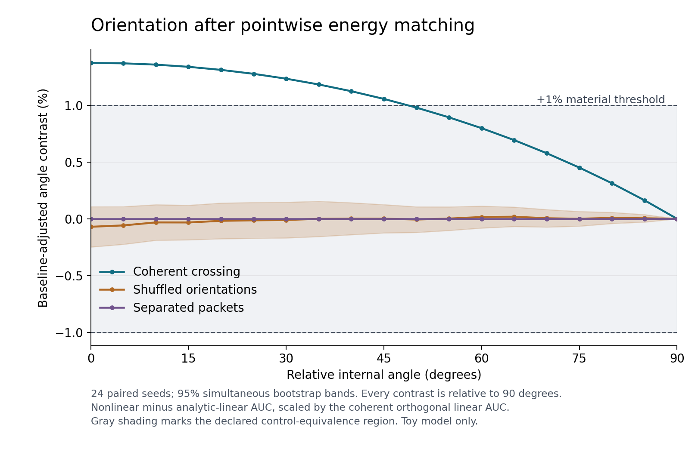

# Energy-matched orientation results: 2026-09-13

**Verdict: PASS_MATERIAL_TOY_ORIENTATION_EFFECT.** The coherent 0-degree versus
90-degree nonlinear increment, after subtracting each field's analytic linear
baseline, is **1.3738%** of the orthogonal coherent linear persistence AUC.
Its paired seed-bootstrap 95% interval is **1.3736% to 1.3740%**. The declared
material threshold was **1%**, fixed before the sweep. All six decision gates
pass in the full 24-seed run.

This supports an orientation-dependent persistence increment in the specified
nonlinear vector-field toy equation. It adds no memory variable and establishes
no physical memory mechanism, new physics, or cosmological interpretation.

## What changed

The September 10 assay matched total initial energy but left the local energy
profile dependent on angle. The new pass imposes a common initial energy map
point by point, retaining each packet sum's internal direction. It also uses
packet-attached amplitude noise instead of additive background vector noise.
This is a stronger, explicitly changed initialization, not a direct replication
of the old AUC values.

The pass samples the continuous angle parameter at 0, 5, ..., 90 degrees. Each
of 24 fixed seeds runs coherent crossing, spatially shuffled relative
orientations, and separated packets. Every initialized field has a matched
linear baseline computed analytically for the same discrete Euler recurrence.

## Primary results

All differences below are **0 degrees minus 90 degrees**, after subtracting the
matched linear AUC. Percentage effects use the same per-seed coherent linear
90-degree reference for all conditions. Its mean AUC is 1.193249306.

| Condition | Paired AUC difference | Effect (%), paired 95% interval | Paired d_z of percentage effect |
| --- | ---: | --- | ---: |
| Coherent crossing | +0.016392714 | +1.373788 [1.373604, 1.373973] | 2899.43 |
| Shuffled orientation | -0.000840207 | -0.070420 [-0.191621, +0.052204] | -0.228 |
| Separated packets | +1.881e-12 | +1.576e-10 [1.5758e-10, 1.5761e-10] | 3717.08 |

The coherent raw paired AUC interval is [0.016390645, 0.016394855]. The enormous
standardized effects in the coherent and separated cases reflect extremely
small seed variation. In particular, the separated case has a negligible
absolute effect despite its large d_z. The material threshold and equivalence
gates, rather than d_z alone, govern interpretation. Full d_z intervals are in
`effects.csv` and `summary.json`.

The paired coherent-minus-shuffled endpoint contrast is **1.444208%**
[1.321478%, 1.565397%], with d_z **4.669** [3.807, 6.539]. The corresponding
coherent-minus-separated contrast is **1.373788%** [1.373604%, 1.373973%].
Both lower bounds clear the 1% threshold.

The coherent mean curve decreases monotonically over the 19 sampled angles.
This is a descriptive statement about that grid, not a proof of monotonicity
over every real angle.



## Control gates and uncertainty

- Initial pointwise energy mismatch is at most **8.06e-16** relative to the
  peak common density, below the 1e-12 tolerance.
- Separated joint evolution differs from independently evolved packet parts
  by at most **3.84e-15** in sampled normalized local energy at the two endpoints,
  below the 0.001 noninteraction tolerance.
- The simultaneous 95% bands across all sampled angles remain within
  **[-0.2482%, +0.1552%]** for shuffled orientations and approximately
  **[0, 1.577e-10%]** for separated packets. Both lie inside the declared
  [-1%, +1%] equivalence interval.
- The bootstrap resamples 24 whole seed blocks 10,000 times, keeping dynamics,
  angles, and controls paired. Its fixed seed is 20260913. There are 24
  independent blocks, not 1,368 independent angle/condition observations.

These intervals describe seed variation under this exact setup. They do not
include discretization, parameter-choice, equation-choice, or physical
uncertainty.

## Supplementary numerical checks

The [supplementary specification](ORIENTATION_NUMERICAL_CHECKS.md) was written
after the first four production seed blocks and before the refinement runs.
It did not alter the primary protocol or threshold.

| Discretization, seeds 0 to 3 | Endpoint effect | Change from matched reference |
| --- | ---: | ---: |
| N=96, dt=0.008 | 1.373911% | Reference |
| N=96, dt=0.004 | 1.371498% | -0.002413 percentage point |
| N=128, dt=0.004 | 1.367402% | -0.006509 percentage point |

Both changes are inside the separately declared 0.1 percentage point agreement
tolerance, and both primary endpoint intervals remain above 1%. This supports
stability of the endpoint under these checks; it is not a continuum limit.

The four-seed timestep run's **standalone** full statistical verdict is
`INCONCLUSIVE_OR_CONTROLS_FAIL`: its coherent-minus-shuffled lower bound is
0.9914%, just below the 1% margin. The finer-grid four-seed run passes its
standalone gates. These smaller endpoint-only checks are not pooled into the
primary sweep, and the timestep run's limited control inference is retained.

## Interpretation and remaining scope

Equal initial energy density does not equalize spatial direction gradients.
Diffusion acts on those gradients, and the amplitude-dependent reaction can
amplify the resulting differences. The linear subtraction removes the linear
contribution but does not eliminate this conventional nonlinear explanation.
The zero-diffusion regression test gives orientation-independent evolution
under the matched initialization, consistent with that explanation.

The result therefore retains a small, material orientation response in these
equations after the requested controls. Packet-width, energy, coefficient,
alternative-equation, and broader discretization sweeps remain open. It does
not establish a history or memory effect in the separate kernel.

## Reproduction and validation

The source baseline was latest main `40d23df`. The original protocol was
committed at `ebe6b19` before outcomes; deterministic process scheduling was
added at `84f5a4f` without changing scientific settings. The full run records
that second revision and exact scientific-source/protocol hashes. Its dirty
flag refers to untracked outputs from an interrupted serial invocation; the
recorded source hashes match the committed files.

The original local source commits are included in the retained
[`source_history.bundle`](../results/orientation_control_2026-09-13/source_history.bundle).
This preserves the exact revisions named by the run manifests when the
authenticated GitHub publication creates a later publication commit. Recovery
instructions are in the [run index](../results/orientation_control_2026-09-13/README.md).

```bash
python -m pip install -e ".[test]"
python -m echofoam_falsifiability.orientation_control_pass --seeds 24 --seed 0 --workers 4 --angle-step 5 --bootstraps 10000 --bootstrap-seed 20260913 --material-fraction 0.01 --output orientation_control_output
python scripts/plot_orientation_control.py orientation_control_output
pytest
```

Use a fresh output directory for another run. Retained outputs are in
[`results/orientation_control_2026-09-13`](../results/orientation_control_2026-09-13).
They include all raw measurements, the pre-run manifest, statistics, diagnostics,
plots, supplementary runs, and a verification record. The full statistics
replay identically from `runs.csv`. The first 171 production rows shared with
the serial invocation are identical under parallel execution.

Local validation: **49 tests passed on Python 3.12.14**, fatal lint and
changed-file style checks passed, and wheel/source distributions built.
The two pytest warnings are pre-existing animation-lifecycle warnings.
